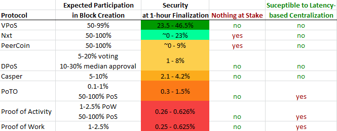

https://fc18.ifca.ai/bitcoin/papers/bitcoin18-final17.pdf
https://pdaian.com/blog/anti-asic-forks-considered-harmful/

THIS PAPER IS CURRENTLY UNFINISHED

# Quantification of security for PoW and PoS Cosensus Protocols

This paper describes a methodology for numerically quantifying the security of a cryptocurrency consensus protocol and applies that methology to compare various protocls in the context of known attacks on those protocols. This paper also discusses related security implications of the designs of those protocols.

This paper will define a metric for the security of a cryptocurrency, enumerate various security risks a cryptocurrency might have, and then evaluate the security of a number of existing or proposed consensus protocols.

# Terminology

Because I will be talking about both Proof of Work and Proof of Stake systems, there are a few terms I'd like to introduce to avoid awkward phrases like miners/minters and hash-power/minting-power.

* Block-creator - An actor that creates blocks for the block chain. This is either a miner in a PoW system, a minter in a PoS system, or both in a hybrid system.
* Block-creation-power - The relative ability of a block-creator to create blocks. For example, in PoW systems this is hash-power - how many hash attempt that block-creator can do per second. In PoS systems this is generally the size of stake. This will often be talked about in terms of percentage. A block-creator that has 20% of the block-creation-power will be able to create on average 20% of the total number of valid blocks created in a given timeframe.

# Quantifying Security

To quantify the security of a blockchain consensus algorithm, I propose examining two major factors:

1. The likely minimum cost of attack, and 
2. The damage done by such an attack.

This methodology allows us to plot any given attack along these two dimensions in order to compare possible attacks on various different consensus algorithms, but can also be used to measure the cost effectiveness of each attack, by dividing the cost of the attack by the damage done by that attack. A consensus algorithm that allows the a more cost-effective attack than another isn't necessarily a less secure algorithm however, because the raw cost of attack has the potential to put the attack beyond feasibility for most or even any foreseeable attacker. As always, security is dependent on what you're trying to secure against, and nothing is 100% secure.

For the purposes of this analysis, I'll define the *cost of an attack* on a consensus protocol as the minimum cost an attacker would have to expend, risk, or obtain in order to have a high likelihood of successfully executing an attack within a reasonable timeframe. The timeframe is important because an attack often cannot be sustained indefinitely. For example, an attacker with exactly 50% of the block-creation-power would not be able to control the blockchain indefinitely, however such an attacker still might have a reasonable probability of successfully attacking the system in a given short window of time.

Since a blockchain consensus algorithm's purpose is almost entirely to prevent censorship attacks and double-spends, the costs and damage-potential of those attacks should define the security of a consensus protocol. In all the systems I have analyzed, both a censorship attack and double-spend require controlling the creation of all the blocks in the chain for a period of time (generally around an hour), and so have the same cost to perform. In fact, both can be done simultaneously. 

#### The Damage

The largest amount of damage that could be done is via double-spends. Even a single double-spend could represent theft of a practically unbounded amount, since cryptocurrency transactions can generally spend very large amounts. The most effective double-spend attack would likely be one that purchases digital goods that can be delivered very quickly, such as other cryptocurrencies. Each double-spend could be on a deposit to an exchange that is used to buy another cryptocurrency and then withdrawn before the double-spend is executed. This could easily be a deposit of over $1 million worth of coins. Therefore a successful double spend attack with thousands of transactions could steal $1 billion or more worth of cryptocurrency. 

Secondarily, this would also disrupt thousands of transactions, which would cause minor to medium inconvenience for most harmed parties. You could maybe estimate that the cost of this would be maybe $10 of people's time per person, so perhaps in the tens of thousands of dollars of damage in total - nothing anywhere near the damage done by the double-spends.

Thirdly, transactions could be censored, which would be even more of a minor inconvenience unless the censorship lasts a long time (days or weeks). However, a successful 51% attack might even be likely to last weeks, since it would take some time to recover and find a workaround. If it does last a week, a ballpark estimate of the damage done could maybe be estimated at $100 per day per censored transaction, so maybe a soft upper bound on the order of $100 million of damage. 

Lastly, the fees for transactions would likely rise substantially. It might even kick off a frenzy of transactions of people trying to safeguard their savings. Fees could rise to 10 times their previous value or more. This could easily cost people $100 per transaction (similar to the damage done by censorship). However it is mutually exclusive with censorship (if your transaction is censored, you're not paying a transaction fee). So this doesn't really increase the damage when considered with censorship. 

To summarize, the damage done by a very short double-spend attack could count in the billions of dollars worth of damage. Extending the attack might add $100 million of damage per week, but if double spends continued in that time, it would cause much more damage, potentially destroying the coin entirely. 

Because of this, I will assume that the potential damage done by a minimal-cost attack is large enough to be worth protecting against. 

#### The Cost (Defining "Security")

Following the above logic, for the purposes of this analysis, I define the "base security" of a particular consensus protocol to mean:

* The lower bound on how much money an attacker would have to obtain and use (but not necessary expend) in order to get at least 1 chance per year to execute a single double-spend attack with a transaction that has followed the protocol's recommended number of confirmations for finalization.

I'll also define the "economic security" of a consensus protocol to mean:

* The lower bound on the net amount of money an attacker would have to expend to breach the "base security". 

In this analysis, I will be talking about security in terms of a percentage of the total coins. So for example, a base security of 20% means that a prospective attacker would need to own wealth with a value equal to at least 20% of the cryptocurrency's coins to execute a successful attack. This lets us normalize the metric so that the consensus protocols can be compared regardless of the market price of the coin. 

In Proof of Work systems, security is directly related to how much money miners spend on mining (assuming all miners have approximately equivalent efficiencies). In Proof of Stake systems, security is directly related to the percentage of the currency that users are using to actively mint blocks.

Proof of Work systems have no upper bound on the theoretical security they can provide - so base security numbers like 400% are possible, however in reality this would not be practical because more money would need to be spent on mining than the currency is worth. So Proof of Work does have practical limits to security, as I will talk about. The base security of a Proof of Stake coin maxes out at 50% - it is impossible for a Proof of Stake currency to have an attack-requirement of more than half the currency's coins, so 50% can be considered the holy grail of consensus protocol security. This 50% number is closely related to the concept of a "51% attack" - basically if 50% of a cryptocurency's block-creation power is controlled by an attacker, the attacker can control the entire chain. This is a fundamental fact about decentralized currencies. [As Charlie Lee said](https://twitter.com/SatoshiLite/status/1082491687169998848): "*If a crypto can't be 51% attacked, it is permissioned and centralized.*"

A canonical description of the cheapest kind of attack is as follows:

1. The attacker would gain a high percentage of block-creation power (hash power for PoW, or stake for PoS).
2. The attacker would make a large number of purchases totaling a large value.
3. The attacker would start mining/minting on the block at the height immediately before the block their payments were confirmed in.
4. As soon as the attacker irrevocably receives the products they purchased (which might happen within minutes for digital assets), the attacker releases their longer chain, causing their payments to be reversed.

This process might be more involved in some currencies, but the general plan is similar: make purchases, then revert the payments by releasing a longer blockchain that doesn't have those payments. The difficulty/cost of doing this depends on how difficult/costly it is to create a longer blockchain than the honest block creators.

# Potential Security Risks

## General Security Risks

This section talks about attack vectors that are applicable to both PoW and PoS systems.

### The Selfish "Economic" Attack

Also known as the Selfish Mining Attack, the [Economic Attack](https://bitcoinmagazine.com/articles/selfish-mining-a-25-attack-against-the-bitcoin-network-1383578440/) is where a selfish block-broadcasting strategy can allow a particular entity to gain more than their fair share of blocks and thereby either run honest block-creators out of the system by reducing their revenue below profitable levels or incentivize block-creators to join their coalition. Both of these outcomes increase the risk of a single entity or coalition gaining enough block-creation power to control the chain and do things like double-spend.

Here is a simplified overview of the attack:

A. If the attacker creates a block sufficiently early of the average block time, the attacker will chose to withhold it from the rest of the network and builds on top of their secret block.
B. As long as the attacker maintains a longer chain than the public chain, they keep creating blocks in secret.
C. As soon as the public chain reaches the same length as the attacker's chain, the attacker publishes their chain hoping for most of the network to see their chain first.

Eyal and Sirer's paper [Majority is not Enough](https://arxiv.org/abs/1311.0243) talks about how Proof of Work is susceptible to this attack no matter how much hashpower the attacker has if the attacker uses a network of nodes that pretend to be mining but actually are used to propagate the selfish-miner's blocks faster than the rest of the network. Eyal and Sirer suggest a partial-fix that when a miner has two potential chains of equal length to mine on top of, they randomly choose the chain to mine on top of. The paper says this makes it so the attacker requires 25% hashpower and goes on to say that theoretically there is no fix that could make this requirement larger than 33%. However, [it has been argued](https://www.yours.org/content/craig-wright-s--negative-gamma--and-the-curious-lack-of-intellectual-c-191f72455730) that the network topology of Bitcoin mining nodes is almost a [complete graph](https://en.wikipedia.org/wiki/Complete_graph) which prevents a network of fake mining nodes from being effective, and so therefore the threshold may actually be 33% rather than 25%.

So the Economic Attack effectively makes susceptible consensus protocols 2/3 to 1/2 as secure as they would be otherwise.

The key vulnerabilities that makes this attack possible is the advantage block-creators get from having early-access to the newest block and the ease of building a hidden chain. Consensus protocols where a lower advantage is obtained from having this early-access, or where a hidden chain is harder to build, would be less vulnerable to this problem.

It should be noted that this attack can't be done at all in any currency that has the nothing-at-stake problem, since block-creators can simply create chains from any previous starting point, allowing them to bypass the 2nd block of the attacker's hidden chain whenever the attacker releases it, negating any benefits the attacker could receive.

### Initial Coin Distribution

Since only people who have coins can mint Proof of Stake blocks, those people would have an advantage in gaining new coins. Even for Proof of Work currencies, the distribution of the currency is seen as important by some in the community.

The problem of fair distribution is somewhat of a contentious one. Some people think things like ICOs are perfectly fine and give the creators compensation for their efforts. Others think that only a world-wide race to create and own a currency is fair. Regardless what is fair, I believe a currency has a far better chance at succeeding if its distribution is as wide as possible among the people interested in obtaining the coin.

The crux of this security risk is that if a currency can't credibly say that its ownership or control is distributed widely, then that currency is more likely to be controlled by a single group and at some point attacked by that group.

#### Mitigations

One way of distributing a new coin is to use PoW mining for the majority or entirety of the distribution. However, this also has its flaws. Its not always possible to verify who is mining the coin, and thus its possible the group that created the coin are its primary miners.

Another way is simply to have an open market for sale of the coin and whoever want to mint that currency's blocks can buy the coins at market price. This has its own problems, however, since markets for new coins can be easily manipulated. And just like PoW, this also doesn't allow verification that those creating blocks and getting the rewards are a sufficiently broad group.

Another solution to this would be to distribute coins to people that are in some way verifiable. This could either be distribution to public entities with high levels of existing trust, or to distribute using some other system that is widely known/believed to have sufficiently distributed identies. For example if bitcoin's distribution is considered sufficient, distributing a new coin based on bitcoin ownership at a certain block would be an example of this.

### DoS risk

A potential problem in consensus systems is the risk that block-creators will be attacked with a Denial of Service attack. In some systems, the block-creators able to create a block are known as soon as the previous block is created, or possibly even earlier. In those cases, those block-creators could be DDOSed (by competing block-creators or by other malicious actors). While the possibility of DoS attacks can't be entirely addressed by the consensus protocol, protocols where its not possible to predict the next block-creator are preferrable since this protects the protocol from disruption even if individual actors aren't protected.

### Time shifting

If actors are incentivized to alter network-time to their advantage, things could go wrong. Block-creators might want to pretend time is moving faster in order to see more coinbase rewards.

However, hopefully there would be enough honest actors to counteract this. Shifting time backward (pretending time is moving slower) could give current potential block-creators more time to realize they're a potential block-creator, create a block, and broadcast the next block, but any active minter is probably instantly aware of this already and minting a block would be a fast operation. Broadcasting can take some seconds, and so might provide some small incentive to time-shift backward. But even if network-time becomes shifted over time, the accuracy of network time isn't that important, only approximate consistency.

All consensus protocols I'm aware of are equally suceptible to the problem of time-shifting, and its generally considered to not really be much of a problem.

## Proof of Work Security Risks

This section talks about attack vectors that are applicable to Proof of Work systems, but not other consensus protocols.

### Theft of Machine Resources

An attacker could steal the hardware or commandeer it for the duration of the attack. If they could steal enough hardware, an attack could be run basically for free (or whatever the cost of the theft is).

Theft could be done today by mining pools (as of June 2020). A mining pool already runs their operation by directing other people's machines to mine a particular block. This could somewhat easily be used to execute an attack for a short period of time. If multiple mining pools were compromised such that the attacker could utilize them all in concert, this would likely be the most feasible way to attack bitcoin at the current time. The attack could last as long as they maintained > 50% of the mining power, which would be limited by pool miners being alerted to the attack and directing their mining power away from the compromised pools. How long that might be is unknown, but it seems like it would be unlikely to last longer than 1 week. Most likely less than a day. However, even an hour is long enough to execute numerous double-spends.

The cost of an attack with stolen machine resources can be nearly free. However, it still doesn't make it easy or likely. And with the development of the [Stratum v2](https://medium.com/braiins/experts-discuss-stratum-v2-and-the-future-of-bitcoin-mining-d62568df73a6) mining protocol, this hole will be closed for good - mining pools will no longer be able to dictate what transactions will be mined and thus can't use their pool miners' resources in an attack.

### Bribe/Rental Attack

Rental is more difficult, because as far as I'm aware, there are no rental services for bitcoin mining hashpower. The fact that bitcoin mining is dominated by ASICs is a huge benefit here. Because the ASIC hardware is so specific to bitcoin, anyone who builds or buys the ASICs intends to mine themselves, and renting it out would almost certainly be a less efficient use.

However, why stick to legal approaches? Botnets are something midway between theft and rental. You can [rent a botnet](https://securelist.com/the-cost-of-launching-a-ddos-attack/77784/#:~:text=This means the actual cost,every hour of an attack.) on the darkweb for $7/hr per 1000 machines. [Graphics cards](https://cointelegraph.com/news/top-graphics-cards-that-will-turn-a-crypto-mining-profit) can do on the order of 10 Million hashes/second, and CPUs can do perhaps 1/3 of that. So assuming each of those machines have a graphics card and cpu that can be utilized, this might mean that each machine could have a hashrate of 13 MH/s. So to gain the [100 million TH/s](https://www.blockchain.com/charts/hash-rate) needed, you'd have to rent a botnet with 40 trillion machines. Clearly an absurd number. It would also cost you $70 billion per hour. So this is kind of not an option, even if there were 40 trillion botnet accessible machines for rent out there at a low low price.

However, this doesn't mean rental is off the table forever. FPGA rental is a thing these days, and if capacity of that ramps enough, that would be a viable way to rent mining power. FPGAs are perhaps 1/10th as cost effective as ASICs, but given that a 51% attack requires so little time, this hit might be well worth it. An FPGA rental attack could cost as little as [$80 million](https://github.com/fresheneesz/quantificationOfConsensusProtocolSecurity#asic-friendly-pow). Of course, today there's nowhere near enough rental FPGA power to pull this off.

Also, there may be ways to develop multi-purpose ASICs that can be used for a number of things, which might make them more cost effective to rent. If such an ASIC were 90% as cost-effective as a full bitcoin ASIC, an attack could be pulled off that would near the cost of a few mined blocks. Theoretically, an attack like this would cost .5/.9 = 55.5% of the reward for 6 blocks which would be 21.7 BTC (6.5 per block * 6 * .555 = 21.7) or about $220,000 and most of that money would be made back in block rewards so the net cost of the attack would only be about $20,000/hour. Of course, again, this is not currently possible since no such rental ASICs are available.

In proof-of-stake protocols, there is a risk that old now-empty wallets could be sold to an attacker, who could then use those old addresses to mint a branched block chain starting from a block where those wallets were not empty. See the section on the [History Attack](#history-attack) for more information about that.

### Purchasing/Building Machine Resources

An attack with purchased hardware would be quite a bit more expensive. Last time I ran the numbers, it would take [about 200,000 btc](https://github.com/fresheneesz/quantificationOfConsensusProtocolSecurity#asic-friendly-pow) to buy 50% of the hashpower. However, an attack like this could be quite a bit more patient and could take advantage of mining economics to push other miners out of the market before executing their attack. I've called this the [Economic Mining Monopoly Attack](https://github.com/fresheneesz/quantificationOfConsensusProtocolSecurity#economic-mining-monopoly-attack), and it basically can cut the cost of an attack in half. So instead of 200,000 BTC, it would cost 100,000. Still quite a lot of money, and that doesn't even include the electricity cost.

### Economic Mining Monopoly Attack

The Mining Monopoly Attack is an attack where an attacker can mine at a loss to run other miners out, which cuts the cost of attack in half. Any Proof of Work system is suceptible to attack.

Consider an environment where mining has near-break-even revenue (or exactly break-even considering opportunity cost) and where there are no altruistic honest miners willing to mine at a loss. In such a situation, any entering block-creation power would correspond with an exit of a similar amount of mining power (theoretically an identical amount, given identical costs). What this means is that an attacker willing to mine 100% of the blocks at a loss can obtain 100% of the (active) hashpower.

An attacker with cost-effective hashpower could slowly obtain ever more hashpower while incurring very little loss. Little loss would occur because any consistent loss is unsustainable for those mining as a business and, one-by-one, block-creators would stop mining until the remaining miners become profitable again. These may be miners that go out of business, or ones that simply move to another cryptocurrency. The quicker the attacker gains this hashpower, the less loss they would incur. For currencies that have periods of set difficulty (like Bitcoin's 2-week difficulty periods), if the attacker obtains all the hashpower in that period, they would incur no loss at all during that time and would only incur loss for the amount of time it takes the honest block creators to cease operation (probably to switch to a different cryptocurrency) once the difficulty adjusts.

Because this attack vector has nothing to do with manipulating the blockchain in programmatically detectable dishonest ways, there's no practical way to prevent someone from executing this.

Even detecting this attack would be difficult as this would look like some miners simply found a more cost-effective way to mine. What you might see is that the honest miners who identify themselves in their blocks will stop mining, however the attacker could publicly identify themselves but also simply claim to have a slightly more efficient way to mine. Since there's no practical way to entice honest miners to mine at a loss as well, and increasing the block revenue would only delay the inevitable, neither of these would be adequate remedies against such an attack.

This scenario still requires the attacker to obtain an amount of hashpower equivalent to the amount of hashpower the honest miners had before the attack was begun. But it means that if there is 100 units of honest hashpower mining a PoW currency, the attacker only needs to obtain 50 units of hashpower (rather than 100), because 50 honest units will exit causing the total number to remain at 100 units (rather than 150 units like one might expect).

## Competitive Centralization

Mining is currently done by those that can efficiently and cost-effectively hash blocks. It takes an average of 60 Zetahashes to produce a block (60 billion tera hashes). It takes a lot of effort (optimizing your rigs) or some lucky circumstances (cheap electricity) to make money mining bitcoin. Most people aren't in a position to make money doing it because the profit margins are thin, and most people aren't in a position to mine at a cost lower than the profit they would make.

Over time, this profit margin squeeze will get tighter and tighter until only the most cost-effective miners are mining. There also economies of scale that make mining cost less per hash the more mining rigs you have set up. And there are also a limited number of places that have cheap enough electricity to be competitive.

Approximately 30%-40% of the cost of bitcoin mining is the cost of the electricity consumed (See note 1). Its possible that the cheapest way to mine will involve using primarily excess energy, for example [from renwables](https://finance.yahoo.com/news/study-over-74-bitcoin-mining-180300738.html), which could be inherently limited in each region, causing mining to naturally decentralize. However, it also seems possible that a small handful of companies in a limited set of countries could end up controlling most of bitcoin mining for the usual reasons that mature industries tend to see company mergers and centralization.

Its still unclear what will happen, but competition centralizing mining is a risk for Proof of Work coins.

https://www.coindesk.com/bitcoin-will-still-bite-the-dust

## Proof of Stake Security Risks

This section talks about attack vectors that are applicable to Proof of Work systems, but not other consensus protocols.

### Nothing-at-Stake

Nothing at stake is a risk for Proof of Stake systems that allow stakers to mint blocks on any chain without any downside. The idea is that if stakers have nothing to lose by minting on a chain that isn't the longest chain, they will mint on as many chains as they can. This could lead to the number of competing chains constantly increases, no blockchain is clearly the longest, and consensus is never reached. This is the expected scenario for a system with a majority of profit-seeking minters, however even sub-majority profit-seeking minters could cause the safe finalization time for transactions to be much longer than on chains without this problem.

#### Mitigations

The mitigation for this issue is to ensure there is in fact something at stake. The usual mitigation is to punish minters who mint on multiple chains, or mint on a chain other than the longest chain. Often this is done by confiscating some of the coins that have been "staked" one one chain when it can be shown that those coins have been used to mint a block on another chain. As long as chains don't have equal likelihood of becoming the main chain, minters have an incentive to mint only on that main chain. 

### Stake-grinding

Stake-grinding is a potential problem in PoS systems where the minter is allowed to significantly affect the likelihood that an address will be given the right to mint on top of a future block. 

#### Mitigations

The possibility of stake grinding can be prevented by ensuring that minters either can't control any factor that determines who can mint future blocks or that those minters can't test to see who can mint future blocks before committing to whatever relevant factor they do control.

### Prediction Attack

A prediction attack would be executed by predicting what minter addresses will come up for some blocks in the future, generating addresses that come up very early in the minter progression, then moving their funds into those addresses so they can mint a higher proportion of blocks than their coin ownership would normally allow. 

#### Mitigations

This attack can be prevented by determining who can mint future blocks using some form of randomness that an attacker has less than complete knowledge of.

### History Attack

In a "history attack", someone acquires a large number of coins, sells them, and then creates a fork from just before the time when their coins were sold. The attacker could also purchase keys for addresses (presumably at very cheap rates) that used to have coins and use those to create a fork from before those coins were moved.

If the attack fails, the attempt costs nothing (or very little in the case of purchasing used keys) because the coins have already been sold; if the attack succeeds, the attacker gets their coins back (a successful double-spend). Extreme forms of this attack involve obtaining the private keys from old accounts and using them to build a successful chain right from the genesis block.

While this attack can be prevented for any user connected to any honest node, it can make an Eclipse Attack more credible at a lower cost to the attacker. This is because an eclipsed user could not obtain information that can show the chain is fake.

#### Mitigations

There are a couple cases: 

A. In cases where the coins are used to mint blocks at a greater height than when those coins were spent (in any chain), this attack could be prevented by having nodes disallow coins that have been moved in any branch of the blockchain from being used to mint coins in any other branch. A node could obtain this proof as long as it is connected to at least one honest node. 

B. In cases where the coins are  used to mint blocks at a heigh less than when those coins were spent, its possible that purchased addresses could be used to capture the progression (see Progression Capture).

### History Replay Attack

An extension of the History Attack is something I call the "history replay attack". The attacker swaps coins with other people, such that they obtain transactions sent to their account using outputs that were unspent before the block they want to branch from. They can then branch from the chain just before they made any of those transactions and create blocks containing the return transactions only, thus multiplying those coins by the number of times they were swapped. Theoretically, this could allow an attacker to be able to create a chain where they own all the coins.

Furthermore, the historical transactions used need not have been published on-chain. Transactions used by a second layer protocol can be used as well. For example, the breach remedy transactions used for lightning network channels could be taken and used on a different chain.

There are mitigations for this explained below, but even with those mitigations this attack can be used to make an eclipsed node more likely to believe that the attacker's chain is the main chain. Because an eclipsed node wouldn't have access to other chains, it wouldn't be able to see the longer main chain to detect the attack. So the History Replay Attack could help trick a victim into accepting a forked chain as the main chain, depending on how much of a drop in minting-rate the victim will accept. For a node that will only accept a 30% drop in minting-rate, the attacker would need to gain enough transactions to multiply their coins up to 70% of the honestly minting coins in order to trick an eclipsed node (if it also ceased minting on the main chain). This is likely to be incredibly difficult to do, but the difficulty depends on what percentage of coins are made available for the necessary swaps (eg coin join or lightning network channels).

#### Mitigations

For attacks using on-chain swaps, the attack can be prevented with a few requirements:

A. Showing proof that the coins used to mint a block on the attacker's chain have been spent on another chain (eg the main chain).
B. Requiring transactions to reference the block-hash of a block minted very recently (to the block that first confirms the transaction).
C. Requiring that a UTXO can't mint a block for a timeout period that is at least as long as the distance between the referenced block height and confirming block given in B.

A isn't sufficient on its own because if the transaction can be spent at any height, the attacker's chain could just as easily spend transactions that invalidate minting coins in the honest chain. B and C prevent this because it narrows the window of usability for the transaction, preventing an attacker from publishing a very new transaction at a much older height.

As an example, the protocol might treats a transaction as valid only if it contains the hash of a block minted at most 30 blocks before the block containing the hash. It would then also require that a UTXO can't mint a block until at least that timeout period (eg 30 blocks in the previous example). This would allow nodes to compare two chains and determine which is the imposter chain by seeing the transactions sending those coins (to the next swap target) in the main chain. This mitigation can also prevent the normal History Attack.

To mitigate the variant of this that uses off-chain transactions, the nodes that hold those off-chain transactions would need to show proof that the transactions used on the attacker's chain are out-of-date. For example, for a lightning channel where an out-of-date breach remedy transaction was used on the attacker's chain to mint, the honest channel partner could prove which chain is the attacker's chain. However, that channel partner only has nothing to lose if sending the proof doesn't compromise their channel. If it does compromise their channel, they may simply opt to let someone else have the burden of proving which chain is the attacker's. So for any proof of stake coin that has second-layer features where non-compromising proofs can't be presented, this presents security risk proportional to how much traffic uses those kind of second-layer features.

The downside of these mitigations is that transactions, once created, can only be minted into a narrow band of blocks. One consequence is that the types of long-lived transaction contracts used in the Lightning Network would be impossible in such a system, because you need to be able to sign a channel state and then let that signed transaction sit off-chain for an undetermined amount of time until its needed for settling. However, short-lived transaction contracts can be renewed on a repeated regular basis in order to keep something like a Lightning channel open indefinitely.

### Progression capture

Similar to quorum capture in quorum-based protocols (like Casper), this attack uses elements of prediction, stake-grinding, and the history attack. An attacker would acquire enough coin to be able to mint enough blocks in a contiguous sequence that they're able to control all the minter secrets. Once the attacker does this, they then permanently control the chain as long as they continue to censor all other minters. Not only can they control the chain, but they can sell off the vast majority of their stake while using stake grinding to figure out what minter secrets to put into blocks in order to keep control of the system. With no lower bound on how much work or time it takes to stake-grind, the amount of stake an attacker needs to keep in order to keep control over the blockchain can theoretically be arbitrarily close to 0 (as long as its actually above 0).

There are two caveats to this attack:

* An attacker can't sell 100% of their coins, since they need some coins in order to continue minting. There is some theoretical lower bound on how much stake an attacker could sell before stake-grinding becomes very expensive. So while an attacker might be able to sell 99% of their coins, they're unlikely to be able to sell most of that last 1% without losing control of the chain.
* Because of non-infinite market liquidity, there would be a maximum rate at which the attacker could sell their coins. The attacker could spend their coins on many different types of assets to get around this tho. Even with that workaround, the price of the coin is likely to tank as soon as people realize that large stakeholders are no longer being allowed to mint blocks. At this point, the community can spring into action and release software that defends against the attacker (which could realistically solve the problem for most people within a week or two, although much damage can be done in that time). This could be compared to a PoW attack where once the attack (say double-spend) is complete, the attacker can sell or reuse the hardware they used in the attack, at which point the final cost the attacker incurred is only the maintenance, electricity cost, and depreciation of the hardware (during the attacker period, which could be as little as 1 hour).

All pure PoS systems are fundamentally susceptible to this kind of progression capture because any randomness is controlled by minters themselves (whereas in PoW, the randomness comes from the work and is not controlled by the miners).

### Minter Bribery

If an attacker can bribe a significant fraction of minters to sign their blocks secretly, those minters could escape the possibility of being punished for dishonest mining while giving an attacker the ability to successfully mint selfishly. This doesn't entirely eliminate the risk of punishment for bribed minters - if the hidden chain is released and doesn't end up becoming the longest chain, those minters that helped mint that chain would lose out. Given that hidden chains would only be useful to an attacker, it seems unlikely that even profit seeking minters would be willing to be bribed, given that any attack is likely to lower the value of the coins they use to mint.

### Profit-seeking Minter Collusion

Since minters will generally prefer blocks minted with earlier timestamps, if a minter comes late to the game and mints a block with an earlier timestamp for an old block-height, other profit-seeking minters might decide to mint on top of that block as well, even at the risk of being subject to minter punishment. If enough minters do this, they could build a longer chain and disrupt the network with a short-range or medium-range revision. If they succeed, they're not punished, but honest minters could be punished. This behavior is at its highest risk of happening if a minter finds a block 1 second after the previous block's timestamp, since it would be impossible for a block to be minted earlier than that (unless it was on top of an earlier block). However, a minter would only rationally do this if they weren't actively minting at the time that old block was minted, since otherwise they could have won the block in a non-contentious way earlier with no major risk of minter punishment. It seems unlikely that this would happen, since not only would this create a huge disruption in the network causing the currency (and therefore their stake) to lose value, but also because another minter could do the same thing to them by mining a block with an earlier timestamp either on the block they mined, or on a previous block.

### Long-term Ownership Centralization

Some have brought up the idea that Proof-of-Stake makes the rich get richer, so to speak. The idea is that the people who have more money will make more money and this would somehow lead to the largest owners eventually owning all the coins. However, this isn't actually what would happen. Since each actively minting address has a chance of minting exactly proportional to their ownership, this means that your expected ROI for minting (as a percentage) will be the same no matter how much coin you own. This means that if everyone is actively minting, no one will gain or lose anything on average over time, tho those that are actively minting would gain more than those that aren't. Also, something similar is true for proof-of-work as well - those that have invested more in mining hardware mine more blocks and thus make more money.

Note that while most PoS don't actually have this problem, Nxt's coin actually does have a rich-get-richer problem because of the way their minting requirement is set up. See [Bitfury's paper on PoS systems](https://github.com/blockchain-university/databank/blob/master/docs/pos-vs-pow-1.0.2.pdf) for details about that.

### Participation Barriers

Many PoS systems have requirements to participating in securing the system, including:

* required locked-in stake to mint (Casper, DPoS, Decred),
* voting on the blockchain (DPoS), or
* waiting period after moving coins (Nxt)

Each of these has their purpose in their respective protocols, but each also puts up a barrier to participating in securing the network. These barriers have important implications because the base security of PoS systems directly depends on what proportion of the coins are being used to secure the network.

In Casper, since you must lock up your coins into stake (like tickets in Decred), its very unlikely that anywhere near a majority of coins will participate in securing the network by being locked up in stake. In fact, the currency wouldn't even be able to function if 100% of the currency's owners tried to participate. Requiring normal (non minting) users to vote on the blockchain is also a significant barrier for DPoS, because users have to pay for on-chain space. Even something as minor as a waiting period between when you use your coins and when you can use them to mint puts up a small barrier that will reduce how many people participate.

The only barriers VPoS has are:

* the requirement that the address being used to mint has enough coin to cover the minter punishment amount, and
* the requirement that the coins being used to mint existed `minterSecretLifetime` number of blocks ago.

Other than that, any coins can be used at any time to mint without exception. This can substantially increase VPoS's base security in comparison to systems that have bigger barriers to minting.

### Latency-based Block-creation Centralization

PoW has an issue where well-connected miners have a mining advantage advantage over less well-connected miners. This stems from the fact that a miner can't mine on blocks until they propagate to that miner, and most blocks, found by a minter between the time between when a new block is minted and the time when that new block has propagated to that minter, are orphaned. What this means is that if blocks on average take 6 seconds to propagate to one miner A and take 1 second to propagate to another miner B, then B has a 5 second advantage on A on average, allowing them to mine approximately 0.9% more blocks for a given amount of hashpower (at 10 minute block times). This puts a limit on how short blocktimes can be made. This also creates pressure for mining operations to create direct low-latency connections between each other, the extreme of that being pressure for mining operations to merge under the same ownership so they can connect optimally.

I haven't found any PoS protocol that has this issue. Theoretically, any currency with the nothing-at-stake problem cannot have this problem at all. VPoS doesn't have this issue because minters are free to build up to 2 blocks on top of previous blocks, meaning that latency would have to be greater than the time it takes to mint 2 blocks to have any affect.

# Mitigation Solutions

## Detecting attacks

When an attack happens, part of the security of the system, beyond the narrow definition above, is how much damage can likely happen in an attack. Detecting an attack early can help limit that damage. Detection can potentially catch an attack in the act so that steps can be taken to halt the attack, or detection can detect that an attack has likely happened in the past so that steps can be put in place to prevent future attacks. Detection can also have false positives, which might be acceptable if they increase the cost of attack or decrease the amount of damage that can be caused. However, detection with false positives has the possibility of being abused by an attacker to wreak other types of havoc, so the consequences of false positives should be considered carefully.

In any attack involving a hidden chain, most nodes in the system will become aware of both the honest chain and the attacker's chain. While those nodes might not be able to tell for certain which is the attacker's chain, they will know something weird is happening and can react to that. In the case that this happens, nodes following the protocol will require more confirmations on transactions until the competing chains are resolved.

# Analysis of Various Consensus Algorithms

Here's a table summarizing the level of base security for each consensus protocol.

Note that in the above, the "base security at 1-hour finalization" is in terms of a percentage of the total amount of coin.

## Analysis of Pure Proof of Work

Mining requirement: `hash(blockHeader) < maxHash/difficulty`

Estimated Base Security: 1.2%

To attack a Proof of Work coin like Bitcoin, the attacker needs 50% of the hashpower and perform a short-range longest-chain attack. Pure proof of work simply doesn’t have a risk of long-range attacks, since short-range attacks are always cheaper.

In pure proof-of-work, a long-range attack is always more expensive than a short-range attack, but in VPoS this isn’t necessarily the case. Because there is no work requirement to create blocks, its plausible an attacker could build an entire new fresh chain longer than the real chain in an arbitrarily short amount of time. At the same time a shorter-range revision would be much harder because the attacker would have to actually obtain a substantial amount of honest coins or obtain access to the private keys of addresses that used to contain substantial amounts of coin.

### ASIC-Friendly PoW

Proof of Work systems like Bitcoin that are "ASIC-Friendly" have mining that's dominated by specialized hardware. In such a system, rental attacks on the top coin using a particular PoW algorithm can be difficult because there would be a negligible amount of hardware not already dedicated to mining that coin. Others have speculated that a rental attack is likely infeasible for Bitcoin, for example.[[1]](https://fc18.ifca.ai/bitcoin/papers/bitcoin18-final17.pdf)[[2]](https://pdaian.com/blog/anti-asic-forks-considered-harmful/)

However, while difficult, a Rental attack still may become feasible in the future. As a thought experiment, we can estimate how much it would cost to run a Rental attack using cloud FPGA services, which actually [already exist](https://thenewstack.io/developers-fpgas-cloud/). FPGAs are the best programmable devices you can get today. Even so, ASICs are generally both 10x faster as well as 10x cheaper to manufacture (post development costs of at least $1 million), making them in the area of 100x more cost effective.[[3]](https://zipcpu.com/blog/2017/10/13/fpga-v-asic.html)

Taking Bitcoin's current rewards of about 13.5 btc per block, that means that miners' collectively are spending at most an average of `13.5 * 6 = 81 btc` for a 6 block period. If we multiply this by `100 - 1 = 99` (minus one to cancel out the mining rewards the attacker will receive), we get an attack cost of 8,019 btc (currently about $80 million) or about 0.04% of the total supply. Luckily there likely isn't nearly enough FPGA capacity available to rent to make this attack possible today. But this calculation shows that one day the rental attack might pose a serious security risk to coins using Proof of Work, even if they are ASIC-friendly.

Build attacks and Buy-out attacks both should have similar costs, since in order to buy hardware it must be built first. We can assume that a Buy-out attack is slightly cheaper than a Build attack.

For bitcoin as of September 2019, Bitcoin miners churned at around [90 million TH/s](https://www.blockchain.com/en/charts/hash-rate) making the cost of building 50% of the hashrate (ie doubling the hashrate) for a Build attack was about 200,000 btc (if using 5.6 million Antminer S9s at [16 TH/s](https://shop.bitmain.com/product/detail?pid=00020190614153859071Q403WQ6D0608) costing [$350](https://shop.bitmain.com/product/detail?pid=00020190614153859071Q403WQ6D0608) a piece) or about 1.1% of the total supply. Thus that is the minimum capital requirement for attacking Bitcoin. However, the selfish-mining problem cuts PoW's base security in half, bringing the base security down to 0.65% of the total coins. Also, its very likely that the ratio of mining revenue per block to total coins will go down substantially in the coming years, which would in turn reduce the base security, as a percentage of total coins, proportionally.

A Bribery attack is the one that Joseph Bonneau pointed out may be the cheapest form of attack. 

### ASIC-Resistant PoW

Rent-a-hashpower may be enormously cheaper for performing 51% attacks. https://www.coindesk.com/51-attacks-for-rent%E2%80%8A-the-trouble-with-a-liquid-mining-market

This is in contrast to proof-of-work where an attacker's success would at most render their mining operation worthless, and a mining operation is unlikely to be valued anywhere near 50% of the coin, since that would mean the miners in total are spending as much to mine the currency as the currency itself is worth, which would be counter productive. Also, mining hardware is unlikely to be completely worthless even if the value of the coin is destroyed, since that hardware can be repurposed.

## Analysis of Hybrid PoW/PoS protocols

### Analysis of Proof of Activity

[Proof of Activity (PoA)](https://www.decred.org/research/bentov2014.pdf) is a hybrid protocol that requires validating each block with both proof of work and proof of stake. While PoA would seem to have good theoretical security against double-spending attacks, the protocol has a number of critical security flaws. You can read more about these flaws [here](https://github.com/fresheneesz/proofOfTimeOwnership).

### Analysis of Ethereum's Casper Proof of Stake system

Minting probability: *proportional to amount of staked coins*.

Estimated Base Security: 4.2%

[Casper](https://github.com/ethereum/research/blob/master/papers/casper-basics/casper_basics.pdf) (see also [the full protocol](https://github.com/ethereum/research/blob/master/papers/CasperTFG/CasperTFG.pdf) and [the rest of the papers](https://github.com/ethereum/research/tree/master/papers)) is a proof-of-stake protocol where a quorum of stakers (the "validator set") votes on which blocks (or "epochs" of blocks) to confirm. The quorum passes its power onto a new quorum each epoch using randomness created in a distributed manner by all the current quorum stakeholders. Casper also requires a separate mechanism to propose blocks to the quorum. Ethereum will do this using the usual Proof-of-Work, but the Casper paper claims it can be done using round robin proposals by stakers (perhaps the quorum stakers).

Since stakers can't use their coins, it is impossible for everyone to participate in Casper minting. In Casper you need to take manual action to stake or unstake your coins. While this could theoretically be as easy as transferring money from a savings to a checking account (and then waiting weeks for the transition to happen), the extra complication there will definitely deter some people from participating or would at minimum prevent willing participants from participating with all their coins. In practice will likely mean that only a small fraction of people will bother to actively participate. Since the security of Casper is highly dependent on the fraction of coin owners that actively participate in minting, this barrier should be considered a significant downside to the protocol.

One primary attack that the Casper protocol goes to lengths to mitigate is long-range revisions where a coalition of validators with 2/3 of a past validator set can create conflicting chains. Casper's solution to this is to simply disallow any reversion of a finalized block. However, this solution doesn't seem sound, because while it prevents active nodes from being fooled by the alternate chain, any node that hasn't caught up beyond the fork point can be fooled, and in fact this rule would make it easier to keep victims fooled since those victims would refuse to revert the attacker's validated block so they could start following the honest chain. 

The second primary attack Casper attempts to mitigate is a catastrophic crash where more than 1/3 of validators go offline. VPoS doesn’t have the problem of catastrophic crashes because it doesn’t use a quorum (aka a validator set), and instead a new satoshi will be given the right to mint a block each second, allowing more and more of the address space to mint a block, meaning that the longer it takes for a block to be mined, the more people will be able to mint a block. Casper's solution to this is to slowly drain funds from validators that don't vote for checkpoints. This means that if more than 1/3rd of the validators suddenly become non-responsive, their funds will be slowly drained until the remaining validators make up more than 2/3rds of the validators set. This solution looks like it should work to solve the problem of catastrophic crashes.

However, this opens up a potential attack vector where any validator could capture the validator set for themselves by pretending all other validators aren't voting, draining their funds, and then capturing the validator set all for themselves. This attack is [detailed here](https://www.reddit.com/r/ethereum/comments/8a4dc0/three_related_hypothetical_security_flaws_in/). All pure PoS protocols have the problem of semi-permanent system capture white at the same time being able to sell off the stake you used to capture the system, which for VPoS is detailed in the section on *progression capture*.

In any case, it seems that an attacker must gain 50% of the validator set in Casper to be able to double spend. For a validator set of 300 validators and an epoch of 50 blocks where each block is 10 minutes, the minimum cost of attacking Casper of about 42% of the active stake, which could be as small as 2.1% of the total coins if only 5% of the total coins are staked (See [costOfAttackingAlts.js](costOfAttackingAlts.js) for the math).

Also, Casper solves the nothing-at-stake problem by using pre-staked ether and confiscating that ether if the validator owning that stake validates blocks on multiple competing chains. VPoS also uses a similar confiscation method. A VPoS chain can allow multiple competing minted blocks temporarily, but will fine minters if they mint too far on the wrong chain. One problem with Casper's punishment mechanism is explained in the paper - if the proposal mechanism is 50% compromised by the attacker, punishments can be censored. Because of this, if an attack is successful and the attacker has compromised the proposal mechanism (which they would also have if the validator set also proposes blocks), the attacker incurs no cost in performing the attack.

Casper requires this separate “proposal mechanism” and currently plans on using a PoW mechanism to do that. That proposal mechanism adds costs to Casper that aren’t discussed in the proposal, since they’re separate. VPoS is self-contained and doesn't need any external mechanism to operate properly.

In summary, Casper has the minor (fixable) issue that long-range revisions can trick nodes that haven't caught up to the fork point, requires an external proposal method, and is unlikely to achieve more than 10% of the total coins being used as active stake since active stake can't be transferred. VPoS has none of these issues, and because for both systems an attacker must achieve nearly 50% of the *active* stake to successfully perform a double spend, and VPoS can realistically achieve nearly 100% of the total coins being used as active stake, VPoS should have approximately 10 times the base security that Casper can achieve in terms of the percentage of the total coins that an attacker needs to successfully attack the system.

## Analysis of Pure Proof of Stake Protocols

### Notes on Objections to Proof of Stake

https://github.com/libbitcoin/libbitcoin-system/wiki/Proof-of-Stake-Fallacy

Many have called proof of stake pointless because any incentive provided to mint PoS blocks will tend toward using an equal amount of resources to the expected reward. See [this article](http://www.truthcoin.info/blog/pos-still-pointless/) for some exposition about that. I agree that it is indeed the case that minters will attempt to expend as much cost as they can in order to maximize their minting rewards. However, this argument has two critical flaws.

The first flaw is that the amount a blockchain costs to support is different from the amount a blockchain costs to attack, and the ratio of blockchain incentives over cost of attack differs between consensus protocols. Consider Bitcoin: in an equilibrium state, an attacker of a pure proof-of-work system like Bitcoin will require purchasing 1/2 of the honest hashpower and running that hardware for the duration of the attack (which could be as little as 1 hour). On the other hand, the honest miners normally must run and maintain this hashpower at all times ad infinitum. So the cost of maintaining the system is far more than the cost of attacking the system. In VPoS, the attacker must gain nearly 50% of the actively minting coins which would be a far higher cost than obtaining half of Bitcoin's hashpower, and yet honest minters aren't expending any significant resources at all to maintain this base security. What this means is that the incentive provided in a system using VPoS can be far lower for a given level of base security than in a PoW system.

The second flaw is that the cost of holding on to currency in order to mint PoS blocks (rather than investing it in some other way) is only a cost to the minter, not to the economy in total. Again, let's consider Bitcoin. When a miner uses electricity to run their mining hardware, the miner loses the electricity (its expended) but also on a global scale that electricity isn't available for anyone else - it is gone for everyone. However, this isn't true of currency. If some currency is removed from circulation by its owner (say for the purposes of minting), all other currency in circulation increases in value by exactly the amount removed from circulation (for the period of time that currency was out of circulation). In other words, while the minter who's using their currency to mint can't use it for other things and thus incurs an opportunity cost, the total value in the economy does not change at all. So a pure proof-of-stake system allows costs to be incurred by individuals while no net economic cost is actually incurred when considering the total economy. This essentially makes proof-of-stake free, even tho its minters do incur opportunity costs. This line of reasoning is actually closely tied to why a non-inflationary currency (ie a currency who's total quantity of coins doesn't change over time) won't actually be the doomsday scenario some have feared.

[BitFury's 2015 paper "PoS vs PoW"](https://github.com/blockchain-university/databank/blob/master/docs/pos-vs-pow-1.0.2.pdf) concludes that "*the state of a PoS system cannot be reliably determined by new users based solely on protocol rules and a list of blocks and other network messages obtained from peers. In order to prevent long range forks of the blockchain, a proof of stake system needs to implement weak subjectivity by combining protocol rules with a social-driven security.*" I believe this is highly misleading because protocol rules themselves are socially-driven. People must ensure that the software they run implements the protocol they want it to. Above, I suggested that a static checkpoint be included in these rules encoded by the software that makes up a coin's network. This can unambiguously protect new users from long-range revisions, so I don't believe this is a reasonable criticism.

### Analysis of Delegated Proof-of-Stake (DPoS)

[DPoS](https://bitshares.org/technology/delegated-proof-of-stake-consensus/) is a proof of stake system where blocks are created by a quorum of minters that are selected by a vote rather than at random. Owners of the coin have a weighted vote proportional to how much coin they own, and they can vote for delegates to be part of the quorum. While in DPoS, an attacker can still compromise the system if they gain 50% of the actively voting stake, there are additional attack vectors. Because being a delegate doesn't require owning a significant amount of stake, an attacker can instead choose to gain the confidence of a number of voters with a combined weight of 50%. While its likely that people wouldn't vote for delegates that don't have substantial stake, its likely that 1% of the coin ownership would be considered substantial to most voters. So an attacker with the confidence voters with a large combined weight could substitute for actual ownership in an attempted attack. This makes DPoS strictly less secure than VPoS, since VPoS doesn't have the social attack vector.

Also, DPoS requires voters to record votes on the blockchain. This has a cost to each voter, which would be a barrier to full voting. Its unlikely that DPoS would be able to achieve as much voter participation as the level of minting participation VPoS can achieve. Also, because misbehavior of delegates would not directly affect the voters that delegated that delegate any more than that misbehavior affects all coin owners, voters may care less about delegate misbehavior than if they were directly linked. I would be surprised if the voting weight of voters who responded to events with their votes in a timely manner can exceed 10% of the total coins in a system used by billions of people.

On the other hand, because DPoS relies on voting, the delegates that win these votes are very likely to be well-known public entities that might have a large incentive not to publicly cause chaos that would be blamed on them and could also have legal ramifications. By the same token, this lack of plausible anonymity reduces the resilience of the system to government action against the coin (eg making being a delegate for that coin illegal or extra-legal harassment of delegates). However, for an attacker that gains enough coins to have 50% of the actively voting stake, that attacker can maintain anonymity by voting for delegates (which the attacker controls) with addresses no one knows the owner of.

The way some DPoS systems (eg Bitshares) choose the number of delegates and the winning delegates allows for voting manipulation by an attacker. If the number of votes the top delegates receive is small, even with a lot of voter participation an attacker could win 50% of the delegation without having anywhere near 50% of the voting power. For example, let's suppose 20% of the coin is used to vote and 10 delegates are chosen per quorum. Let's further suppose that the winner who got the 50th percentile of votes is approved by about 30% of the voters. In such a circumstance, an attacker would only need slightly more than 30% of the voting power, since the attacker could approve 5 delegates by approving 5 delegates with their 31% of the vote. Also, it would also generally be easier for an attacker to capture 50% of the delegation when the number of delegates that are chosen are fewest, so an attacker would vote to lower the number of delegates to as small as possible.

In some DPoS coins (eg BitShares), certain network parameters (eg block size, fees, etc) can be changed by special delegates. However, this means that if an attacker manages to achieve 50% of the delegates, they can change parameters of the consensus protocol, potentially tightening their stranglehold on the blockchain.

In summary, because the base security of DPoS depends heavily on the active participation in voting for delegates by coin owners and because active voting is a manual process (making it expensive), the percentage of the coin owned by active voters is likely to be much less than active minters in VPoS. This in turn means DPoS is likely to be substantially less secure than VPoS - likely 10 or 20 times less secure.

### Analysis of PeerCoin

Mining requirement: `hash(prevBlockTimestamp, unspentOutput) < balance(unspentOutput) * age(unspentOutput) * maxHash/difficulty`

*(Note that this is somewhat of a [simplification](https://github.com/peercoin/peercoin/blob/master/src/kernel.cpp#L426) and that the Bitfury paper incorrectly included a hash of the previous block inside the hash on the left side.*)

[PeerCoin](https://peercoin.net/whitepaper.php) uses a hybrid PoS/PoW protocol where minters use up their *coin age* (the age of a given unspent output multiplied by its amount of coin) in order to win the right to create the next block. PeerCoin also uses pretty standard PoW blocks that compete alongside these PoS blocks. To mint a PoS block, addresses are released over time (similarly to VPoS) depending on the address's coin-age and balance.

The protocol has many problems:

* The use of coin age also substantially decreases the base security of the system, since an attacker with much less than 50% of the coin ownership could dominate the chain long enough to double spend by simply waiting for their coins to age enough to make that possible. 
* The problem of long-range-revisions is addressed by suggesting checkpoints. However the white paper suggests using centrally broadcast checkpoints "*a few times daily*" and considered this less than ideal but "acceptable". Apparently, this has been changed to something like every 2 weeks. However in my opinion, having automatic centrally broadcast checkpoints of any kind is in no way acceptable for a distributed protocol. It introduces a critical central point of failure that can completely and entirely compromise the system. An automatic checkpoint update is not secure, which is why VPoS suggests hardcoded and auditable checkpoints that only change when a user decides to manually update their software.
* The nothing-at-stake problem is also addressed by these checkpoints. However the author of PeerCoin didn't believe the nothing-at-stake problem would happen for some reason. While this may be true for altrustic minters, for profit-seeking minters, this is not true. Neither does periodic checkpointing solve the problem. Other [arguments from proponents of PeerCoin](http://wiki.peercointalk.org/index.php?title=Myths#Nothing-at-stake) include:
  * The idea that there is something at stake because minting on chains that aren't the longest is bad for the network and therefore risks the value of the coin in total. While true, this simply doesn't hold up to the tragedy of the commons. Because any individual minting on multiple chains (or not) doesn't have a significant affect, individuals will tend to do it even tho the negative affect of everyone doing it is substantial.
  * The idea that conflicting blocks aren't propagated. This helps this particular problem to a degree, but does nothing to help newly entrant nodes and opens up other attack vectors (for example sybil attacks that lock nodes into an attacker's chain).
  * The top block is reverted if conflicting blocks minted using the same output are found. Even without considering the flaws of this in cases where it's applicable, the fact is that this would almost never be applicable since an attacker would have their stake split up in to many many outputs and would almost never need or want to use the same output in close succession.
* They acknowledge that minters might not want to cooperate with each other and not propagate other minters' blocks. However, they misinterpret Babaioff et al that fees are the cause, whereas Babaioff's work concludes that competition for miner rewards is the cause. So in their misinterpretation, they decide to burn fees and yet keep coinbase rewards. However, this doesn't solve the problem. In fact it likely has very little effect at all, since to maintain the same incentives, additional inflation must be introduced that would on average be the same as if the fees were given to minters rather than being burned.

The author even muses incorrectly that an "*attacker’s coin age is consumed during the attack, which may render it more difficult for the attacker to continue preventing transactions from entering main chain.*". This seems to be more wishful thinking than any rigorous position, since that would *not* render it more difficult for the attacker to continue controlling the chain, just as honest minters aren't prevented from securing the network as a result of them having to use up their coin age.

See https://talk.peercoin.net/t/looking-for-a-review-of-the-comparison-between-peercoin-and-vpos/7867/7 for some additional info that isn't found in the whitepaper or the Bitfury paper. 

If PeerCoin didn't have its PoW component, it would be susceptible to prediction attacks, since the only randomness involved in deciding who mints each block is the randomness of who is actively minting at a given time and what transaction output they use to mint. Because prediction attacks involve moving coins and this destroys the coin-age necessary to mint, this makes prediction attacks substantially more difficult than they would otherwise be, but the risk would still be there for an attacker to mint more blocks than their fair share. However, its unlikely a prediction attack could be used to help double-spend, since the length of the chain depends on destroyed coin-age and not just the current difficulty.

So going back to our definition of base security: how much stake would an attacker require to have an opportunity to double-spend on PeerCoin once per year on average? An ideal attack on PeerCoin might look like the following:

1. The attacker obtains a certain amount of coins and continuously tests for opportunities to double spend. The longer this process takes, the more coin age the attacker builds up
2. When an opportunity is found, the attacker then spends some or all of their coins on the main chain
3. At the same time, the attacker builds a secret chain using their coins to mint blocks faster than the honest chain

At a 10-minute blocktime target and 6 confirmation finalization (for ~1 hour finalization time) and an average minter coin-age of 2/3rds of a year (which empirically seems to currently be the case), this would allow someone with only 9% of the actively minting coins to execute a double-spend once per year. So with 50% to 100% minter participation, the cost of an attack is 4.5% to 9% of the total coins. See [costOfAttackingAlts.js](costOfAttackingAlts.js) for the math. If the nothing-at-stake problem ends up meaning many profit-seeking nodes will mint on top of an attacker's chain or possibly give the attacker chains to gain a head start from, the security is even worse.

Peercoin's white paper is particularly sparse, and certainly doesn't define a complete protocol. As far as I know, they have never released a proper spec of their protocol. Because of this, its possible my understanding of the protocol doesn't quite match what they've implemented. The authors of the PeerCoin white paper don't seem to have spent much time considering the attacks and degradations their system allows for. The base security of PeerCoin is one of the worst in comparison to protocols like Casper, DPoS, or VPoS, but even so likely requires more resources to attack than PoW.

### Analysis of NXT

Mining requirement: `generationSignature(0) < t * balance(account) * maxHash/difficulty`

* where `generationSignature(height)` is `sign(publicKey(account), generationSignature(height-1))`
*(Note that the Bitfury paper also misleadingly included a hash of the previous block inside the hash on the left side.*)

[NXT coin](https://bravenewcoin.com/assets/Whitepapers/NxtWhitepaper-v122-rev4.pdf) is a pure PoS protocol works on similar principles to PeerCoin except that it doesn't use coin age but rather just uses the address balance. So while NXT avoids the couple critical issues related to coin age, it runs into many of the same security issues. It also doesn't solve the nothing-at-stake problem. Nxt points out the history attack, but its proposed solution does not in fact solve the problem. They claim that since stake must be stationary for 1440 blocks, the attacker can't use that moved stake to "forge" (ie mint) blocks, however the attacker's stake won't have moved in the attacker's chain which doesn't contain those transactions. Also, its suggestion that a reorganization limit of 720 blocks solve long-range revision attacks isn't totally the case. Any new node downloading the blockchain(s) from scratch could be fooled regardless of that rule.

It should be noted that the nothing-at-stake problem is not an attack. A single actor can't perform a nothing-at-stake attack (there is no such thing), tho many in the Nxt community [seem to think](https://www.reddit.com/r/NXT/comments/29yzuw/how_does_nxt_solve_the_nothing_at_stake_issue/) it is, for some reason. The nothing-at-stake problem is the property of a system where profit-seeking actors will rationally mint on pretty much anything they can. Nxt does have this problem, and given enough time, one should expect more and more actors in that system to exhibit this behavior as a higher percentage of Nxt users become profit-seeking rather than altruistic (since early adopters for these things are far more likely to be altruistic than late comers). An environment with substantial actors displaying this behavior makes finalization take far longer and/or makes it far easier for an attacker to double-spend.

Bitfury [pointed out](http://bitfury.com/content/5-white-papers-research/pos-vs-pow-1.0.2.pdf) that minting rewards in Nxt aren't strictly fair - minters with more stake will receive a higher proportion of the minting rewards than the proportion of stake they have. So in Nxt, the rich do get richer (while in PoS systems with fair distributions, this isn't usually the case).

In a minimal cost attack on Nxt, an attacker would check what potential blocks they could create in the next 10-block window (10 confirmations is considered "permanent" according to the white paper) and if the attacker predicts a high likelihood they can create a 10 block chain before the honest network can, the attacker can spend on the honest chain, then revert that chain with a hidden chain attack. With just this, an attacker with 9.8% of the active stake gets an opportunity to double-spend more often than once per year on average. Even if 60 confirmations are used (to match bitcoin's average of 6-block/1-hour finalization time), an attacker with 30.1% of the active stake has one opportunity per year to attack. See [costOfAttackingAlts.js](costOfAttackingAlts.js) for the calculations. Factoring in the rich-get-richer effect and that 30.1% probability of minting a block only requires about 23% of the active stake. All in all, Nxt has some of the best base security of any of the PoS systems out there, tho VPoS beats it by anywhere from 2- to 10-fold.

Nxt does, however, have an interesting proposed solution for long-range revisions, requiring a hash of a recent block in each transaction so that long range revisions wouldn't be able to include real transactions. However, this increases the size of transactions and doesn't prevent an attacker from using their own transactions inside their alternate chain. While more expensive, it could probably offer partial mitigation of shorter medium-range revisions than hardcoded checkpointing can prevent (since there is a limit to how often users can feasibly and safely update their software).

### Analysis of Ouroboros

Ouroboros is a Proof of Stake protocol used by the Cardano currency.

https://cardanodocs.com/cardano/proof-of-stake/

### Analysis of Nano

## Prior work and other reading

For comparisons and analysis of other Proof of Stake systems, see [BitFury's 2015 paper "PoS vs PoW"](https://github.com/blockchain-university/databank/blob/master/docs/pos-vs-pow-1.0.2.pdf)

# Discussion and Review

Please feel free to use the github issues as a forum for questions and discussing this paper.

# Notes

1. Approximately 30%-40% of Bitcoin mining costs come from electricity usage, based on an approximate rate of [75 TWhs/yr](https://digiconomist.net/bitcoin-energy-consumption) which is an average of `(75 TWhs/yr)/((365*24*60 minutes/yr)/(10 minutes/block) = 1400 MWh/block`, and since the majority of bitcoin mining uses [hydroelectric power](https://www.vox.com/2019/6/18/18642645/bitcoin-energy-price-renewable-china#targetText=According%20to%20the%20bitcoin%20energy,66.7%20terawatt%2Dhours%20per%20year.), off-peak electricity probably costs between [$20 and $60 per MWh](https://en.wikipedia.org/wiki/Cost_of_electricity_by_source#Regional_and_historical_studies). This leads to the reasoning that between $28,000 and $84,000 of each block's mining costs come from electricity (`1400*20` and `1400*60`). This is 20% - 60% of the 13.5 btc ($135,000) of revenue per block.

# References

1. [Hostile blockchain takeovers - Joseph Bonneau 2018](https://fc18.ifca.ai/bitcoin/papers/bitcoin18-final17.pdf)
2. [Anti-ASIC Forks Considered Harmful - Philip Daian](https://pdaian.com/blog/anti-asic-forks-considered-harmful/)
3. [FPGAs vs ASICs - ZipCPU 2017](https://zipcpu.com/blog/2017/10/13/fpga-v-asic.html)